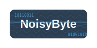

[](https://opentelemetry.io/)
[](https://www.jaegertracing.io/)


# noisy byte

a test app for experimenting with observability instrumentation and performance engineering concepts. Made with react, node js express, redis, and sqlite3.

please note this app is not intended for production use and is purpose is soley as a learning tool.

link to blog article on this project (coming soon)


## features

this project is made up of a todo list app with a basic client-server with cache architecture that allows users to create, read, update, and delete data. The app is instrumented with open telemetry for tracing, metrics, and logging. Included is a "sound board page on the front end" to simulate a "noisy" app environment.

## demo
wip


## local installation and dev setup

the application is based on a client-server architecture. The client is a react app and the server is a node js express app. The server uses sqlite3 as a database. The developer setup is relativley simple with the following steps listed below.


- system requirements
    - node js
    - npm
    - redis

note for windows developers, redis is not directly supported. you can use the windows subsystem for linux (wsl) to install redis and run it as a daemon. which is the recommended way to run redis on windows. See the following link for more information on how to install redis on windows.
https://redis.io/docs/latest/operate/oss_and_stack/install/install-redis/install-redis-on-windows/


```bash
# step 1: clone the repo
git clone https://github.com/mmaquer2/noisy-byte.git

# step 2: install dependencies
cd noisy-byte/app
npm install

cd noisy-byte/server
npm install

## step 3: create a .env file in the server directory
cd noisy-byte/server
cp .env.template .env

## step 4: start the redis service 

# for mac users
brew services start redis # Start Redis

# for linux users
sudo systemctl start redis-server

# for windows users using wsl 
sudo service redis-server start

## step 5: start the server and client
# start backend and database
cd server
node server.js

# start frontend
cd app
npm run start

# step 6: open the browser and navigate to http://localhost:5173 to view the app frontend

```

## testing

The api server is tested with jest and supertest. And the front end is tested with playwright. To run the tests, you can use the following steps.

the test suite must pass before making a pull request to the main branch.

```bash
# step 1: run the server tests
cd noisy-byte/server
npm run test

# step 2: run the client tests
cd noisy-byte/app
npx playwright test

```

### setting up jaeger for tracing (optional)

The application is thoroughly instrumented with open telemetry. If you would like to setup jaeger for visualizing the tracing telemtery, you can follow the steps below to set up a local instance with docker. 

The instrumentation  config code can be found in the /server/config/instrumentation.js file.

```bash
# step 1: verify docker is installed 
docker --version 

# stpe 2: pull the jaeger all in one container
docker pull jaegertracing/all-in-one:latest

# step 3: start the jaeger all in one container
docker run --rm \
  -e COLLECTOR_ZIPKIN_HOST_PORT=:9411 \
  -p 16686:16686 \
  -p 4317:4317 \
  -p 4318:4318 \
  -p 9411:9411 \
  jaegertracing/all-in-one:latest

# step 4: open the browser and navigate to http://localhost:16686 to view the jaeger ui

```

## deployments

this app is not intended for production use. but to deploy the app to a cloud provider, you can use the following steps to run the docker images in the cloud service of your choosing.

```bash
wip
```

### frameworks, libraries, and tools used in this project

- https://fakerjs.dev/  - generate fake data
- winston - logging
- jaeger - tracing visualization
- react lucid - ui components and design https://lucide.dev/
- opentelemetry - observability instrumentation (tracing, metrics, logging)
- sqeuelize - ORM
- sqlite3 - database
- express - server
- react - client
- redis - cache
- auth - jwt 
- bycrpt - password hashing


### interesting reads related to this project
- intro to wide events, https://isburmistrov.substack.com/p/all-you-need-is-wide-events-not-metrics
- using jaeger with open telemetry data, https://www.jaegertracing.io/docs/1.63/getting-started/
- examples of otel and javascript, https://github.com/open-telemetry/opentelemetry-js/tree/main/examples
- intro to redis and node js, https://www.digitalocean.com/community/tutorials/how-to-implement-caching-in-node-js-using-redis
- creating sane and custom node js express logs with winston, https://betterstack.com/community/guides/logging/how-to-install-setup-and-use-winston-and-morgan-to-log-node-js-applications/